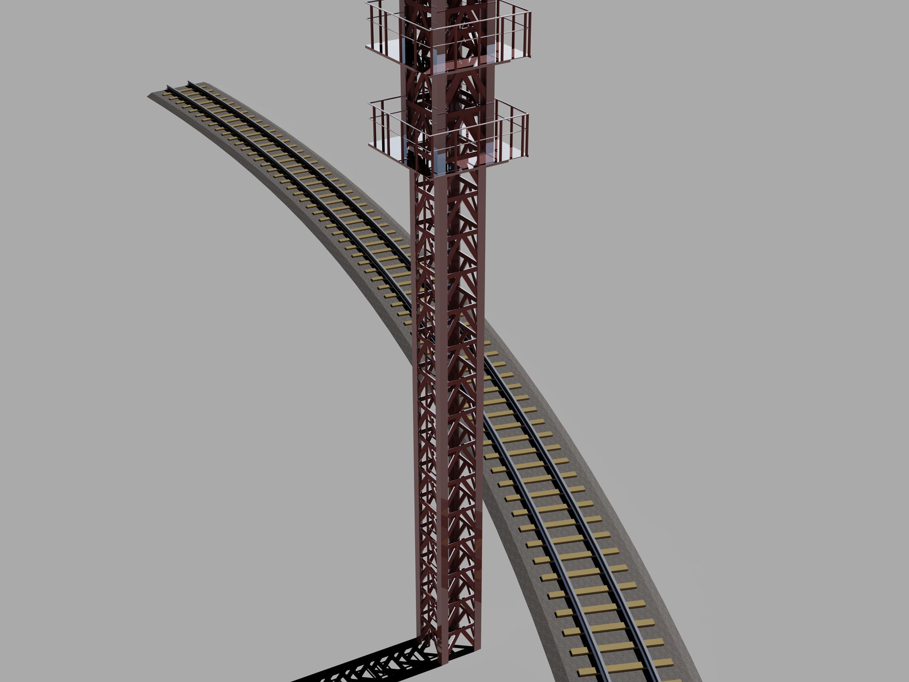

# RhinoArchitecturalLibrary
Rhino Common SDK上で建築に関わる基本的なツールを提供するライブラリです。

## 使い方
二つの使い方が想定されています。
* プラグインを作成し、Rhinoceros上から直接使う。
  * 新規にプラグインプロジェクトを立ち上げ、このプロジェクトを参照してください。
* Grasshopper上のC#コンポーネントから扱う。
  * やや面倒ですが、Grasshopper上のC#コンポーネントに各ファイルの中身をコピー・ペーストして使ってください。その際、usingとnamespaceは除かなければなりません。
  
## ギャラリー

## サンプル
サンプルプロジェクトは[こちら](https://github.com/kurema/CellTower)。
