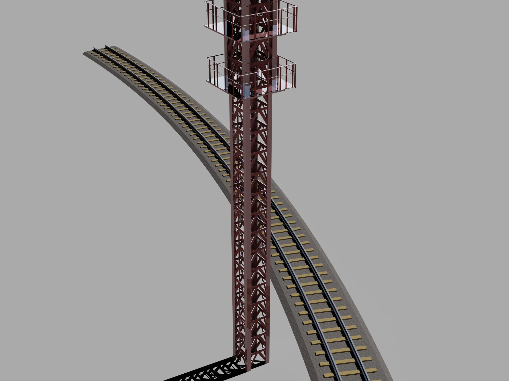
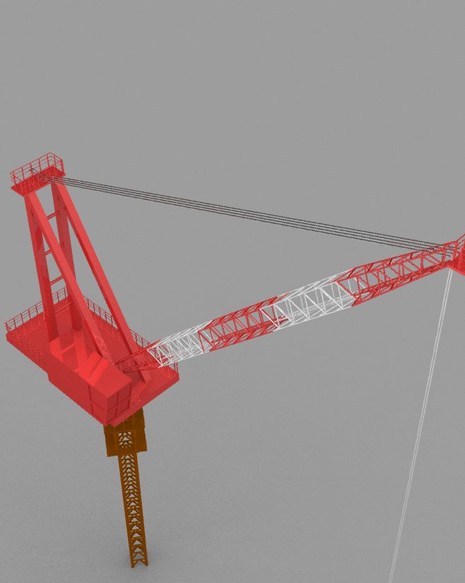
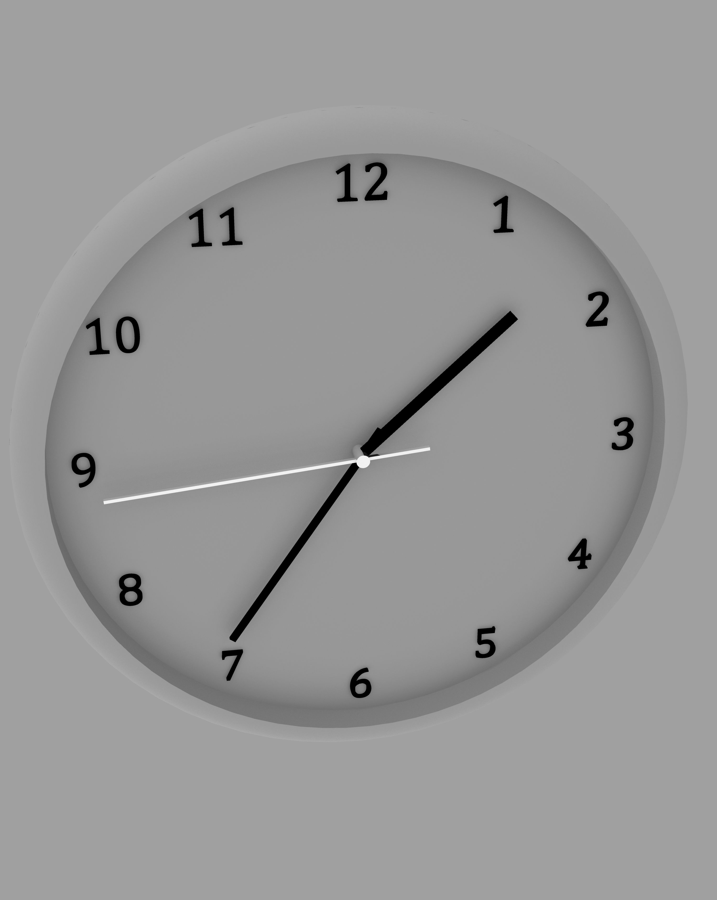
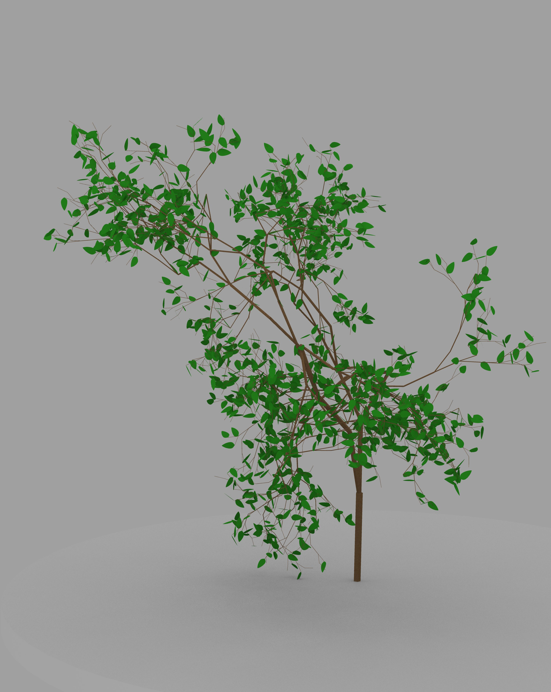

# RhinoArchitecturalLibrary
Architectural library for Rhino Common SDK.
This includes lots of functions.

[日本語](README.ja.md)

## Sample Project
You can see how much this can do [here](https://github.com/kurema/CellTower).

## How to use
Get gh file in [Release](https://github.com/kurema/RhinoArchitecturalLibrary/releases), then write a small code using included C# component.

## Gallery

